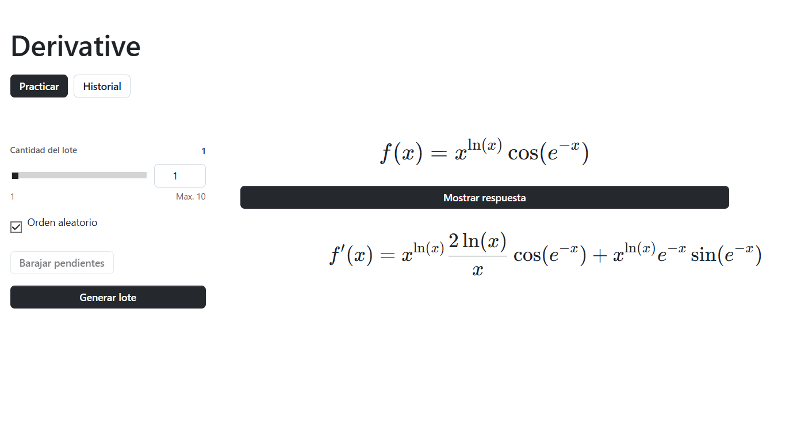

# Habitro

A daily learning system optimized for retaining and learning school material.



Habitro combines individualized SQLite-based performance tracking with a daily learning workflow. In my current setup it covers Spanish grammar, Catalan, and maths exercises that I do daily.

## What It Does

- Tracks practice performance per exercise type with SQLite-backed history.
- Builds daily sessions across Spanish grammar, Catalan, syntax, morphology, and derivatives.
- Keeps mistakes and previous attempts available for review.
- Supports manual question banks and generated practice where configured.
- Runs as a React/Vite web app, with an older Streamlit workflow still present for local experimentation.

## Run The Web App

```bash
npm install
npm run dev
```

## Build

```bash
npm run build
```

## Optional Streamlit Workflow

```bash
pip install -r requirements-streamlit.txt
streamlit run streamlit_app.py
```

If no API key is configured, local examples and manually imported decks can still be used where supported.
